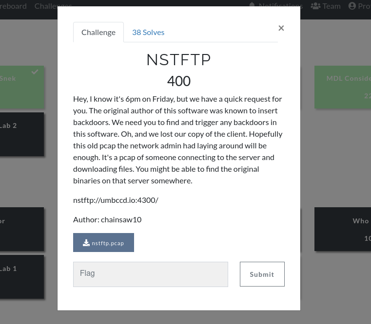

# DawgCTF 2021: nstftp



Repo related to the challenge _"nstftp"_ from **DawgCTF 2021**, along with my auxiliary/solution programs used to solve it.

To read the complete challenge write-up, follow this link.

## Dir structure
`nstftp_chall` contains all the files related to the challenge itself, including the original `.pcap` file with the interactions between an unknown client and server, and also the `nstftp` server.

The current directory has the 2 programs I made that were used to get the flag, including the `nstftp` client that complied with the underlying protocol being used, and also the client name crafter used to trigger the backdoor.

## Basic usage

Run the ftp server:

```
user@e27335e10fe2:~/nstftp/nstftp_chall# ./nstftp
Listening on 0.0.0.0:1337

```

And then with the client:

```
user@e27335e10fe2:~/nstftp# ./nstftp_client.py localhost 1337
[+] Welcome to NSTFTPv0.1!
[+] Available commands: ls get help crash flag exit
[+] Opening connection to localhost on port 1337: Done
nstftp>  
```

Then the server view should look like this:

```
user@e27335e10fe2:~/nstftp/nstftp_chall# ./nstftp
Listening on 0.0.0.0:1337
Accepted connection from 127.0.0.1:50194
Forked child pid 1135127
[1135127]: Talking to NSTFTP-client-go-dawgs
```
